# How to use `quizli`?

!!! info   
    The demos are created with the [`termtosvg`](https://github.com/nbedos/termtosvg) tool using the `window_frame_powershell` theme. 

## How to get help ?

!!! example
    - `quizli --help`
    - `quizli demo --help`
    - `quizli start --help`
    

## How to start a quiz from a csv file?

!!! example
    - `quizli start --from-csv examples/quiz.csv --in-order`
    
    !!! tip 
        We use `--in-order` to _not_ shuffle the quiz before starting it.
        

    
## How to start a built-in quiz?

### Python Quiz

!!! example
    - `quizli start --quiz-name python-quiz --randomize`
    
    !!! tip 
        We use `--randomize` to explicitly shuffle the quiz before starting it.

#### Quiz on Python modules

        
#### Quiz on Python objects

### Binary Number Quiz

!!! example
    - `quizli start --quiz-name binary_number_quiz --mode sudden_death`

    !!! tip 
        We use `--mode sudden_death` to configure the quiz session such that a single incorrect answer terminates the quiz. 
        

        
## How to open this demo page from the CLI ?

!!! example
    - `quizli demo`

